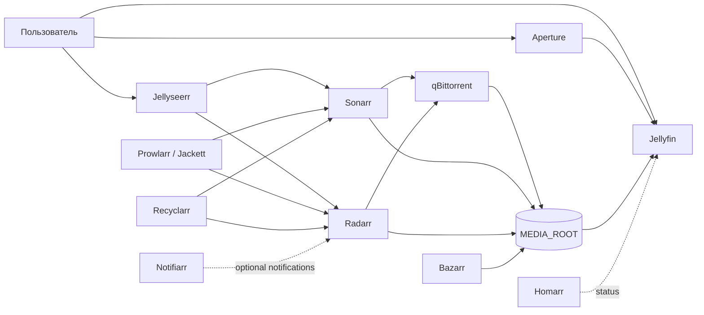

<a id="top"></a>
<div align="center">
  

  <br>

  [](https://github.com/yinon-mitin/jellyfin-media-server-stack/actions/workflows/validate.yml)
  
  
  
  

  **Воспроизводимая Docker-сборка домашнего медиасервера на базе Jellyfin и *Arr-экосистемы.**

  [Быстрый старт](#-быстрый-старт) · [Архитектура](#-архитектура) · [Команды](#-команды) · [Восстановление](docs/RESTORE.md) · [Безопасность](SECURITY.md)
</div>

---

## Зачем эта сборка

Обычный `docker-compose.yml` с тегами `latest` не является резервной копией: registry может отдать другой образ, локальные пути теряются, а секреты легко случайно отправить в Git. Этот репозиторий разделяет четыре типа состояния и проверяет их автоматически:

| Контракт | Где хранится | Политика |
| --- | --- | --- |
| Топология сервисов | `stack/docker-compose.yml` | Git |
| Версии OCI-образов | `stack/versions.env` | Git, только SHA-256 digest |
| Пути и секреты | `stack/.env` | локально, вне Git |
| Базы и медиатека | `APPDATA_ROOT`, `MEDIA_ROOT` | отдельный зашифрованный backup |

> [!IMPORTANT]
> Репозиторий воспроизводит платформу, но намеренно не содержит пользователей Jellyfin, историю просмотров, API-ключи, торрент-состояние, названия или файлы фильмов. Полное восстановление этих данных требует отдельного backup `APPDATA_ROOT`.

## Содержание

- [Возможности](#-возможности)
- [Архитектура](#-архитектура)
- [Состав](#-состав)
- [Быстрый старт](#-быстрый-старт)
- [Команды](#-команды)
- [Воспроизводимость](#-воспроизводимость)
- [Backup и восстановление](#-backup-и-восстановление)
- [Структура репозитория](#-структура-репозитория)
- [Безопасность](#-безопасность)
- [Документация](#-документация)
- [Участие в разработке](#-участие-в-разработке)
- [Благодарности и товарные знаки](#-благодарности-и-товарные-знаки)

## ✦ Возможности

- **Immutable deployments:** 17 образов закреплены digest, без `latest` в итоговом Compose.
- **Cross-platform baseline:** основные сервисы проверены для `linux/amd64` и `linux/arm64`; Aperture явно запускается как `linux/amd64`.
- **One-command quality gate:** `make test` проверяет Compose, image lock, секреты и запрещённые файлы.
- **Clean-room restore:** локальные пути задаются одним `.env`, а порядок восстановления документирован.
- **Controlled upgrades:** `make update-lock` обновляет digest только осознанно и оставляет reviewable diff.
- **Runtime verification:** контейнеры, health, restarts и HTTP endpoints проверяются через `make verify`.
- **Bounded logs:** Docker JSON logs ротируются по 3 файла × 10 MB.
- **Private-data boundary:** базы, логи, media catalogue, torrents и credentials исключены строгим `.gitignore` и safety scanner.

## ⬡ Архитектура



Подробные потоки данных, state boundaries и уровни зрелости описаны в [`docs/ARCHITECTURE.md`](docs/ARCHITECTURE.md).

## ◈ Состав

| Слой | Сервисы | Порты по умолчанию |
| --- | --- | --- |
| Playback | Jellyfin, Aperture | `8096`, `3000` |
| Requests | Jellyseerr | `5055` |
| Library automation | Sonarr, Radarr, Bazarr, Recyclarr | `8989`, `7878`, `6767` |
| Index and download | Prowlarr, Jackett, FlareSolverr, qBittorrent | `9696`, `9117`, `8191`, `9090` |
| Automation extras | Autobrr, qbit_manage, TorrServer, Profilarr | `7474`, `18090`, `6868` |
| Operations | Homarr, Notifiarr | `7575`, `5454` |

По умолчанию запускаются 16 сервисов. Notifiarr находится в optional profile и включается после привязки API-клиента к аккаунту.

## ▶ Быстрый старт

### Требования

- Git;
- Docker Engine, Docker Desktop или OrbStack;
- Docker Compose v2;
- Make;
- Python 3.

### Установка

```sh
git clone https://github.com/yinon-mitin/jellyfin-media-server-stack.git
cd jellyfin-media-server-stack
make init
```

Отредактируйте созданный `stack/.env`:

```dotenv
TZ=Asia/Jerusalem
PUID=1000
PGID=1000
APPDATA_ROOT=/absolute/path/to/docker/appdata
MEDIA_ROOT=/absolute/path/to/media
DOWNLOADS_ROOT=/absolute/path/to/downloads
JELLYFIN_AUX_CACHE=/absolute/path/to/jellyfin-cache
HOMARR_SECRET_ENCRYPTION_KEY=replace-with-openssl-rand-hex-32
```

Проверка и запуск:

```sh
make test
make pull
make up
make ps
```

Откройте:

- Jellyfin: `http://localhost:8096`
- Aperture: `http://localhost:3000`
- Jellyseerr: `http://localhost:5055`
- Homarr: `http://localhost:7575`

Порядок первичной настройки сервисов приведён в [`docs/RESTORE.md`](docs/RESTORE.md).

### Optional Notifiarr

Notifiarr не запускается без profile, чтобы непривязанный клиент не создавал постоянные `401 Unauthorized`:

```sh
COMPOSE_PROFILES=notifiarr make up
ENABLE_NOTIFIARR=1 RUN_EXTERNAL_CHECKS=1 make verify
```

## ⌘ Команды

| Команда | Назначение |
| --- | --- |
| `make init` | создать локальный `stack/.env` |
| `make test` | выполнить полный статический quality gate |
| `make config` | показать разрешённую Compose-конфигурацию |
| `make pull` | загрузить закреплённые OCI-образы |
| `make up` | запустить или обновить stack |
| `make down` | остановить stack |
| `make ps` | показать контейнеры и health |
| `make logs` | следить за ротируемыми логами |
| `make verify` | проверить работающие сервисы и endpoints |
| `make update-lock` | обновить immutable image digests |

Расширенная live-проверка:

```sh
RUN_DEEP_CHECKS=1 RUN_EXTERNAL_CHECKS=1 make verify
```

## ⛓ Воспроизводимость

`stack/versions.env` содержит ссылки только такого вида:

```text
repository/image@sha256:<immutable-digest>
```

Обновления не происходят автоматически:

```sh
make update-lock
make test ENV_FILE=stack/.env.example
git diff -- stack/versions.env
```

Новый digest необходимо проверить на временном `APPDATA_ROOT`, затем на копии production state. Подробнее: [`docs/REPRODUCIBILITY.md`](docs/REPRODUCIBILITY.md).

## ↺ Backup и восстановление

1. Остановите приложения или используйте их built-in backup, чтобы получить согласованные SQLite-файлы.
2. Зашифруйте snapshot `APPDATA_ROOT` на стороне клиента.
3. Храните ключ отдельно от архива и GitHub.
4. Проверяйте восстановление на отдельном каталоге и Docker project.
5. Не выполняйте downgrade поверх базы, уже мигрированной новой версией.

Полный runbook: [`docs/RESTORE.md`](docs/RESTORE.md).

## ⌂ Структура репозитория

```text
.github/workflows/validate.yml   CI quality gate
assets/logo.svg                  оригинальный знак проекта
assets/banner.svg                README masthead
stack/docker-compose.yml         topology и runtime contract
stack/versions.env               immutable image lock
stack/.env.example               sanitized local-input contract
stack/verify-stack.sh            live verification
scripts/                         safety, lock и distribution validators
docs/                            architecture, reproducibility, restore
frpc/frpc.example.toml           optional sanitized FRP template
components/aperture.md            Aperture source revision и custom patch
```

## ◉ Безопасность

Перед каждым push:

```sh
make safety
git diff --cached
```

Никогда не коммитьте `.env`, `appdata`, базы, логи, API keys, server endpoints, torrent metadata, субтитры, media files или library exports. При утечке удаление следующими коммитом недостаточно: credential необходимо немедленно ротировать, а историю Git — переписать.

Политика: [`SECURITY.md`](SECURITY.md).

## ▤ Документация

- [`docs/ARCHITECTURE.md`](docs/ARCHITECTURE.md) — потоки данных и state ownership;
- [`docs/REPRODUCIBILITY.md`](docs/REPRODUCIBILITY.md) — immutable inputs и promotion rules;
- [`docs/RESTORE.md`](docs/RESTORE.md) — clean install, restore и rollback;
- [`components/aperture.md`](components/aperture.md) — upstream revision и custom image patch.

## Участие в разработке

Изменения принимаются через небольшие ветки и review. Требования к image updates, миграциям и проверкам описаны в [`CONTRIBUTING.md`](CONTRIBUTING.md).

## Благодарности и товарные знаки

Структура README вдохновлена рекомендациями проекта [Awesome README](https://github.com/matiassingers/awesome-readme). Сборка использует независимые open-source проекты, которые распространяются под лицензиями их авторов.

Jellyfin является товарным знаком Jellyfin Project. Этот репозиторий — независимая пользовательская сборка, не официальный продукт и не аффилирован с Jellyfin Project. Логотип репозитория оригинален и не воспроизводит официальный знак Jellyfin.

<div align="center">
  <sub>Infrastructure is code. Runtime data is not.</sub>
  <br><br>
  <a href="#top">Наверх ↑</a>
</div>
