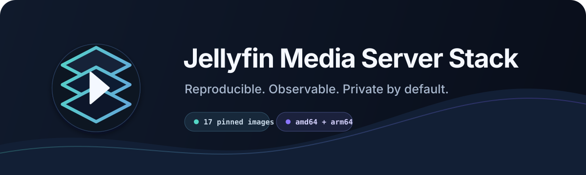
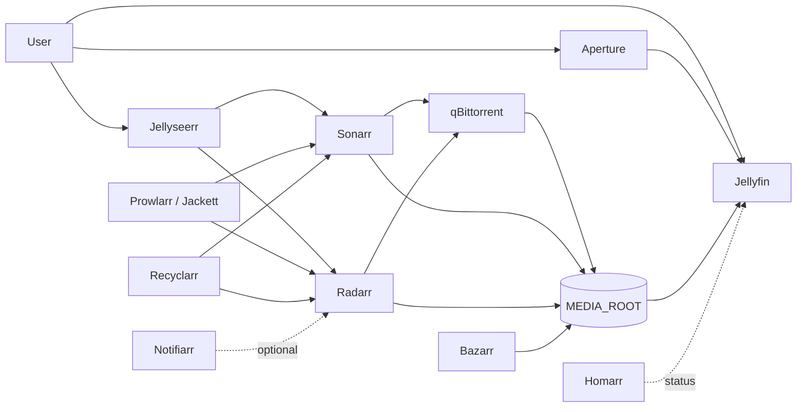

<a id="top"></a>
<div align="center">
  

  [](https://github.com/yinon-mitin/jellyfin-media-server-stack/actions/workflows/validate.yml)
  [](README.md)
  [](README.ru.md)
  [](LICENSE)
  
  

  **A reproducible Docker media stack built around Jellyfin and the *Arr ecosystem.**

  [Quick start](#quick-start) · [Architecture](#architecture) · [Operations](#operations) · [Restore guide](docs/RESTORE.md)
</div>

## Overview

This repository defines a 17-service media platform with immutable container images, portable host configuration, automated validation, and a documented restore path. Application state and media stay outside Git.

> [!IMPORTANT]
> The repository recreates the platform, not its runtime data. Jellyfin users, watch history, API keys, torrent state, and library metadata require a separate encrypted backup of `APPDATA_ROOT`.

## Stack

| Layer | Services | Default ports |
| --- | --- | --- |
| Playback | Jellyfin, Aperture | `8096`, `3000` |
| Requests | Jellyseerr | `5055` |
| Library automation | Sonarr, Radarr, Bazarr, Recyclarr | `8989`, `7878`, `6767` |
| Indexing and downloads | Prowlarr, Jackett, FlareSolverr, qBittorrent | `9696`, `9117`, `8191`, `9090` |
| Automation | Autobrr, qbit_manage, TorrServer, Profilarr | `7474`, `18090`, `6868` |
| Operations | Homarr, Notifiarr | `7575`, `5454` |

Sixteen services start by default. Notifiarr uses an optional profile so an unpaired client does not generate repeated authentication failures.

## Architecture



The complete data-flow and state-ownership model is in [Architecture](docs/ARCHITECTURE.md).

## Quick start

Requirements: Git, Docker with Compose v2, Make, and Python 3.

```sh
git clone https://github.com/yinon-mitin/jellyfin-media-server-stack.git
cd jellyfin-media-server-stack
make init
```

Edit `stack/.env` with absolute host paths, the runtime UID/GID, timezone, and a new Homarr key. Then run:

```sh
make test
make pull
make up
make ps
```

Open Jellyfin at `http://localhost:8096`. The recommended application setup order is documented in the [restore guide](docs/RESTORE.md).

### Optional Notifiarr profile

```sh
COMPOSE_PROFILES=notifiarr make up
ENABLE_NOTIFIARR=1 RUN_EXTERNAL_CHECKS=1 make verify
```

## Operations

```text
make init         Create stack/.env from the sanitized template
make test         Run repository, image-lock, and Compose checks
make config       Print the resolved Compose configuration
make pull         Pull the pinned OCI images
make up           Start or update the stack
make down         Stop the stack
make ps           Show container and health status
make logs         Follow bounded Docker logs
make verify       Check running containers and HTTP endpoints
make update-lock  Resolve source tags to new immutable digests
```

Deep runtime checks are opt-in:

```sh
RUN_DEEP_CHECKS=1 RUN_EXTERNAL_CHECKS=1 make verify
```

## Reproducibility

- `stack/versions.env` pins every image as `repository@sha256:digest`.
- `stack/.env` contains machine-specific paths and secrets and is ignored by Git.
- `make test` rejects floating images, missing services, secrets, runtime files, and invalid Compose.
- Image updates are explicit: run `make update-lock`, inspect the diff, and test against disposable state before production.

See [Reproducibility](docs/REPRODUCIBILITY.md) for the exact contract and its limits.

## Documentation

| Topic | English | Русский |
| --- | --- | --- |
| Project overview | [README](README.md) | [README](README.ru.md) |
| Architecture | [Architecture](docs/ARCHITECTURE.md) | [Архитектура](docs/ru/ARCHITECTURE.md) |
| Reproducibility | [Reproducibility](docs/REPRODUCIBILITY.md) | [Воспроизводимость](docs/ru/REPRODUCIBILITY.md) |
| Restore and rollback | [Restore](docs/RESTORE.md) | [Восстановление](docs/ru/RESTORE.md) |
| Contributing | [Contributing](CONTRIBUTING.md) | [Участие](CONTRIBUTING.ru.md) |
| Security policy | [Security](SECURITY.md) | [Безопасность](SECURITY.ru.md) |
| Contributors | [Contributors](CONTRIBUTORS.md) | [Контрибьюторы](CONTRIBUTORS.ru.md) |
| Aperture component | [Component lock](components/aperture.md) | [Компонент](components/aperture.ru.md) |

## Contributors

Maintained by [Yinon Mitin](https://github.com/yinon-mitin), with AI-assisted engineering and documentation. The participating model and tooling are listed in [CONTRIBUTORS.md](CONTRIBUTORS.md).

## License

The repository code and original visual assets are available under the [MIT License](LICENSE). Bundled services and container images retain their own licenses.

Jellyfin is a trademark of the Jellyfin Project. This is an independent community distribution and is not affiliated with or endorsed by the Jellyfin Project. The repository logo is original and does not reproduce the official Jellyfin mark.

<div align="center"><a href="#top">Back to top</a></div>
