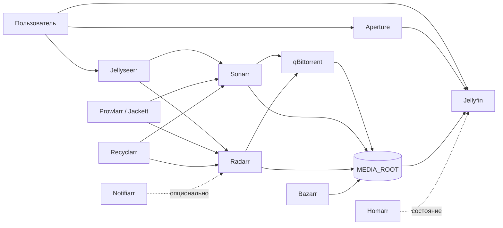

<a id="top"></a>
<div align="center">
  

  [](README.md)
  [](README.ru.md)
  [](LICENSE)

  **Phanes — воспроизводимая Docker-сборка медиасервера на базе Jellyfin и *Arr-экосистемы.**

  [Быстрый старт](#быстрый-старт) · [Архитектура](#архитектура) · [Управление](#управление) · [Восстановление](docs/ru/RESTORE.md)
</div>

## О проекте

**Phanes (Фанет)** — кодовое имя проекта в честь первородного божества орфической космогонии. Его имя связывают со значениями «выводящий на свет» и «делающий видимым». Это точно описывает систему, которая превращает частную коллекцию медиа в цельную и доступную библиотеку.

Репозиторий описывает медиаплатформу из 21 сервиса: версии контейнеров закреплены, доступ ограничен LAN/Tailscale gateway, добавлены мониторинг, зашифрованные backup, автоматические проверки и проверенное восстановление. Данные приложений и медиатека остаются вне Git.

> [!IMPORTANT]
> Репозиторий восстанавливает платформу, но не рабочие данные. Пользователи Jellyfin, история просмотров, API-ключи, торрент-состояние и метаданные библиотеки требуют отдельного зашифрованного backup `APPDATA_ROOT`.

## Состав

| Слой | Сервисы | Порты по умолчанию |
| --- | --- | --- |
| Воспроизведение | Jellyfin, Aperture | `8096`, `3000` |
| Запросы | Jellyseerr | `5055` |
| Автоматизация библиотеки | Sonarr, Radarr, Bazarr, Recyclarr | `8989`, `7878`, `6767` |
| Индексация и загрузка | Prowlarr, Jackett, внутренний FlareSolverr, qBittorrent | `9696`, `9117`, `9090` |
| Дополнительная автоматизация | Autobrr, qbit_manage, TorrServer, Profilarr | `7474`, `18090`, `6868` |
| Управление | Homarr, Uptime Kuma, Caddy gateway, Docker socket proxy, Notifiarr | `7575`, `3001`, `5454` |

По умолчанию запускаются 20 сервисов. Notifiarr вынесен в отдельный профиль, чтобы непривязанный клиент не создавал постоянные ошибки авторизации.

## Архитектура



Полная схема потоков данных и границ состояния приведена в документе [Архитектура](docs/ru/ARCHITECTURE.md).

## Быстрый старт

Требования: Git, Docker с Compose v2, Make и Python 3.

```sh
git clone https://github.com/yinon-mitin/jellyfin-media-server-stack.git
cd jellyfin-media-server-stack
make init
```

Укажите в `stack/.env` абсолютные пути, UID/GID, часовой пояс и новый ключ Homarr. Затем:

```sh
make test
make pull
make up
make ps
```

Jellyfin доступен по `http://<LAN_IP>:8096` в LAN и `http://<TAILSCALE_IP>:8096` через Tailscale. Порты приложений публикуются только через привязанные к интерфейсам Caddy gateway. Подробности — в [руководстве по эксплуатации](docs/ru/OPERATIONS.md).

### Опциональный профиль Notifiarr

```sh
COMPOSE_PROFILES=notifiarr make up
ENABLE_NOTIFIARR=1 RUN_EXTERNAL_CHECKS=1 make verify
```

## Управление

```text
make init         Создать stack/.env из безопасного шаблона
make test         Проверить репозиторий, lock-файл образов и Compose
make config       Вывести итоговую конфигурацию Compose
make pull         Загрузить закреплённые OCI-образы
make up           Запустить или обновить сборку
make down         Остановить сборку
make ps           Показать контейнеры и их состояние
make logs         Читать ротируемые Docker-логи
make verify       Проверить контейнеры и HTTP endpoints
make configure-monitoring  Создать мониторы Uptime Kuma
make backup       Создать зашифрованный application-consistent Restic snapshot
make verify-backup  Восстановить во временный каталог и проверить базы
make update-lock  Получить новые immutable digest для исходных тегов
```

Расширенные проверки запускаются отдельно:

```sh
RUN_DEEP_CHECKS=1 RUN_EXTERNAL_CHECKS=1 make verify
```

## Воспроизводимость

- `stack/versions.env` закрепляет каждый образ как `repository@sha256:digest`.
- `stack/.env` хранит локальные пути и секреты и исключён из Git.
- `make test` отклоняет плавающие версии, пропавшие сервисы, секреты, рабочие данные и некорректный Compose.
- Обновления выполняются явно: запустите `make update-lock`, проверьте diff и протестируйте изменения на временных данных.

Точный контракт и ограничения описаны в документе [Воспроизводимость](docs/ru/REPRODUCIBILITY.md).

## Документация

| Раздел | Русский | English |
| --- | --- | --- |
| Обзор | [README](README.ru.md) | [README](README.md) |
| Архитектура | [Архитектура](docs/ru/ARCHITECTURE.md) | [Architecture](docs/ARCHITECTURE.md) |
| Воспроизводимость | [Воспроизводимость](docs/ru/REPRODUCIBILITY.md) | [Reproducibility](docs/REPRODUCIBILITY.md) |
| Восстановление | [Восстановление](docs/ru/RESTORE.md) | [Restore](docs/RESTORE.md) |
| Эксплуатация и backup | [Эксплуатация](docs/ru/OPERATIONS.md) | [Operations](docs/OPERATIONS.md) |
| Участие | [Участие](CONTRIBUTING.ru.md) | [Contributing](CONTRIBUTING.md) |
| Безопасность | [Безопасность](SECURITY.ru.md) | [Security](SECURITY.md) |
| Контрибьюторы | [Контрибьюторы](CONTRIBUTORS.ru.md) | [Contributors](CONTRIBUTORS.md) |
| Компонент Aperture | [Компонент](components/aperture.ru.md) | [Component lock](components/aperture.md) |

## Контрибьюторы

Проект поддерживает [Yinon Mitin](https://github.com/yinon-mitin). Модели и инструменты, участвовавшие в разработке, перечислены в [CONTRIBUTORS.ru.md](CONTRIBUTORS.ru.md).

## Лицензия

Код репозитория и оригинальные графические материалы распространяются по [лицензии MIT](LICENSE). Сервисы и контейнерные образы сохраняют собственные лицензии.

Jellyfin является товарным знаком Jellyfin Project. Это независимая пользовательская сборка, не связанная с Jellyfin Project и не одобренная им. Логотип репозитория оригинален и не воспроизводит официальный знак Jellyfin.

<div align="center"><a href="#top">Наверх</a></div>
